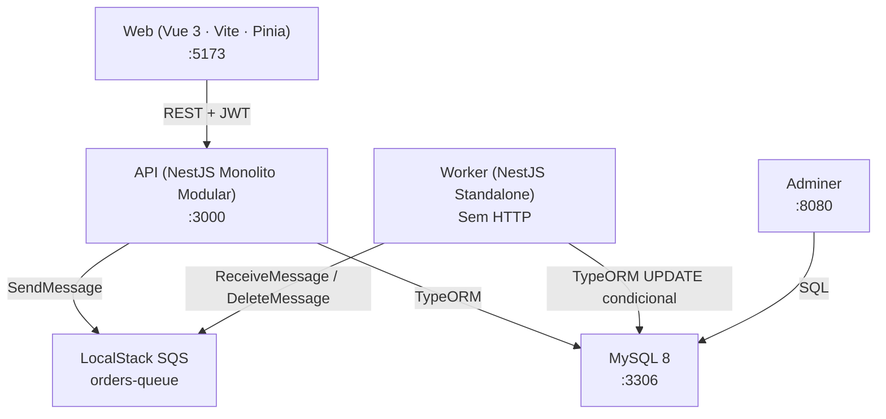

# be-aliant Full-Stack Challenge – Plano de Implementação

Mini-sistema de cadastro e processamento assíncrono de pedidos, com backend NestJS, worker SQS standalone e SPA Vue 3. O objetivo deste plano é detalhar cada decisão técnica antes de qualquer linha de código.

---

## Arquitetura Geral



**Decisão central:** Monolito Modular (NestJS `api/`) + Worker Standalone (`worker/`) + SPA desacoplada (`web/`). Os três vivem no mesmo repositório (monorepo leve, sem Nx/Turborepo para não aumentar complexidade).

### Por que NestJS e não Express puro?
NestJS entrega nativamente DI, Modules, Guards, Exception Filters e ValidationPipe. Express exigiria construir toda essa infra manualmente — risco de perder pontos em Clean Code e Modularização.

### Por que Monolito Modular e não Microserviços completos?
O domínio é minúsculo (Users + Orders). Três serviços HTTP independentes seria overengineering para 6-8 horas. O Worker isolado cumpre **exatamente** a exigência de processamento assíncrono sem overhead desnecessário de rede.

### Por que NestJS Standalone no Worker?
`NestFactory.createApplicationContext()` levanta o container de DI sem HTTP server — reutiliza entidades, repositórios e services sem duplicação de código. Stateless por design: escala horizontalmente via ECS Fargate lendo a mesma fila SQS.

---

## Stack Definitiva

| Camada | Tecnologia | Justificativa |
|--------|-----------|---------------|
| API | NestJS 10+ (TypeScript) | DI, Guards, Filters, Pipes nativos |
| ORM | TypeORM 0.3+ | 1ª classe com NestJS + migrations geradas |
| Validação | class-validator + class-transformer | ValidationPipe global + `@Exclude` em senha |
| Auth | @nestjs/jwt + passport-jwt | Industry standard NestJS |
| Logger | **Pino** (nestjs-pino) | Structured JSON, alta performance |
| Config | @nestjs/config + **Joi** | App não sobe com envs faltando |
| Mensageria | @aws-sdk/client-sqs (SDK v3) | Modular, tree-shakeable |
| Worker | NestJS Standalone Application | Sem HTTP, reutiliza DI do api/ |
| Banco | MySQL 8.0 | Conforme requisito |
| Infra local | docker-compose + **LocalStack** + **Adminer** | Simula SQS sem credenciais reais |
| Frontend | Vue 3 + Vite + TypeScript | Composition API + `<script setup>` |
| Estado | **Pinia** | Substituto oficial do Vuex no Vue 3 |
| HTTP client | Axios | Interceptors para JWT e redirect 401 |
| CSS | TailwindCSS | Responsividade com mínimo de CSS manual |

---

## Estrutura de Pastas

```
be-aliant-challenge/
├── common/                      # Entidades, DTOs e interfaces compartilhadas
│   ├── entities/                # entre api/ e worker/ (evita duplicação)
│   └── dto/
│
├── api/                         # NestJS – Monolito Modular
│   └── src/
│       ├── modules/
│       │   ├── auth/            # POST /login · JwtStrategy · JwtAuthGuard
│       │   ├── users/           # POST /users · PUT /users/:id
│       │   ├── orders/          # POST /orders · GET /orders · GET /orders/:id
│       │   └── messaging/       # Módulo isolado SQS (SqsProducerService)
│       ├── common/
│       │   ├── filters/         # GlobalExceptionFilter
│       │   ├── interceptors/    # LoggingInterceptor (método + path + status + ms)
│       │   └── decorators/      # @CurrentUser()
│       └── main.ts              # CORS · ValidationPipe global · Pino
│
├── worker/                      # NestJS Standalone – SQS Consumer
│   └── src/
│       ├── main.ts              # createApplicationContext()
│       ├── worker.module.ts
│       └── order-processor/
│           ├── order-processor.service.ts
│           └── order-processor.module.ts
│
├── web/                         # Vue 3 + Vite + Pinia
│   └── src/
│       ├── router/              # Vue Router + guard beforeEach
│       ├── stores/              # authStore + ordersStore
│       ├── api/                 # http.ts (Axios instance)
│       ├── views/               # Login · Orders · CreateOrder · OrderDetail
│       └── components/          # AppHeader · OrderCard · StatusBadge
│
├── docker-compose.yml           # api + worker + mysql + localstack + adminer + sqs-init
├── .env.example                 # Todas as variáveis (incluindo AWS_ENDPOINT local)
├── README.md                    # Como rodar + decisões + diagrama Mermaid + prod
└── docs/
    └── architecture.png         # Diagrama exportado (Excalidraw/draw.io)
```

---

## Contratos de API

| Method | Path | Auth | Status de sucesso |
|--------|------|------|-------------------|
| POST | `/users` | Public | 201 `{ id, name, email }` |
| PUT | `/users/:id` | JWT | 200 `{ id, name, email }` |
| POST | `/login` | Public | 200 `{ accessToken }` |
| POST | `/orders` | JWT | 201 (salva `PENDENTE` + envia SQS) |
| GET | `/orders?status=` | JWT | 200 `[]` |
| GET | `/orders/:id` | JWT | 200 |

**Envelope de erro padronizado (GlobalExceptionFilter):**
```json
{ "statusCode": 404, "message": "Order not found", "error": "Not Found" }
```

**SQS Message payload:**
```json
{ "orderId": "uuid", "userId": "uuid", "total": 99.90, "sentAt": "ISO8601" }
```

---

## Padrão de Idempotência do Worker

> Este é o ponto mais técnico do Worker e o que o avaliador irá questionar.

```typescript
// UPDATE condicional – evita race condition entre réplicas e redeliveries
const result = await orderRepo.update(
  { id: orderId, status: OrderStatus.PENDENTE },  // WHERE
  { status: OrderStatus.PROCESSADO },              // SET
);

if (result.affected === 0) {
  // Já processado → descarta silenciosamente
  logger.warn({ orderId }, 'Order already processed, skipping');
  await sqs.deleteMessage(receiptHandle);
  return;
}

// deleteMessage SOMENTE após UPDATE bem-sucedido
await sqs.deleteMessage(receiptHandle);
```

**Loop fail-safe:**
```typescript
while (true) {
  try {
    await orderProcessorService.pollAndProcess();
  } catch (err) {
    logger.error(err, 'Unhandled error in poll loop — continuing');
    // Mensagem volta via VisibilityTimeout; processo nunca morre
  }
  await sleep(SQS_POLL_INTERVAL_MS);
}
```

---

## Segurança

| Vetor | Mitigação |
|-------|-----------|
| Senhas | `bcryptjs` cost factor 12 + `@Exclude()` via class-transformer |
| SQL Injection | TypeORM Repository com parâmetros bound (nunca raw SQL interpolado) |
| JWT | HS256, expiração via env, `sub` = userId |
| CORS | Configurado no `main.ts` — **sempre no backend, nunca no frontend** |
| Envs | Joi schema no `ConfigModule.forRoot()` — app não sobe com vars faltando |
| ValidationPipe | `whitelist: true, forbidNonWhitelisted: true` globalmente |

---

## Git Branching

| Branch | Conteúdo |
|--------|----------|
| `main` | Código entregável final |
| `feature/infra-setup` | docker-compose, LocalStack, .env.example |
| `feature/api-auth-users` | NestJS base, Users, Auth, testes |
| `feature/api-orders-messaging` | Orders + MessagingModule, testes |
| `feature/worker-consumer` | Worker SQS polling |
| `feature/vue-frontend` | Vue 3, Pinia, Axios, views |
| `feature/polish-and-tests` | README, diagrama, cobertura final |

---

## Plano de Execução (~6-8 horas)

### Fase 0 – Infra (~40 min) · `feature/infra-setup`
- `docker-compose.yml`: MySQL 8 + Adminer + LocalStack + serviço `sqs-init` que roda após o LocalStack healthy e cria a fila automaticamente:
```yaml
command: >
  aws --endpoint-url=http://localstack:4566
      --region us-east-1
      sqs create-queue --queue-name orders-queue
```
- Healthchecks em todos os serviços + `depends_on: condition: service_healthy`
- `.env.example` completo: `DB_HOST`, `DB_PORT`, `DB_USER`, `DB_PASS`, `DB_NAME`, `JWT_SECRET`, `AWS_ENDPOINT=http://localstack:4566`, `AWS_REGION=us-east-1`, `SQS_QUEUE_URL`, `SQS_POLL_INTERVAL_MS`

### Fase 1 – Backend Base + Auth (~60 min) · `feature/api-auth-users`
- NestJS init, TypeORM config, ConfigModule Joi, ValidationPipe global
- GlobalExceptionFilter, LoggingInterceptor, Pino
- Módulo Users (entity, repo, service, controller, DTOs)
- Módulo Auth (JwtStrategy, JwtAuthGuard)
- Testes: `users.service.spec.ts`, `auth.service.spec.ts`

### Fase 2 – Orders + Mensageria (~70 min) · `feature/api-orders-messaging`
- `MessagingModule` isolado com `SqsProducerService` injetável
- Módulo Orders (entity, repo, service, controller, DTOs)
- `POST /orders` → salva PENDENTE + publica SQS
- `GET /orders?status=`, `GET /orders/:id`
- Testes: `orders.service.spec.ts`, `sqs-producer.service.spec.ts`

> **Nota:** Consistência transacional — se o publish no SQS falhar após o save, o pedido fica PENDENTE "órfão". **Em produção:** Outbox Pattern. Documentado no README.

### Fase 3 – Worker (~50 min) · `feature/worker-consumer`
- `NestFactory.createApplicationContext()` sem HTTP
- Loop de polling com fail-safe global
- UPDATE condicional (idempotência real)
- `deleteMessage` apenas após sucesso
- Log estruturado (Pino) em todos os eventos

> 📌 **Preparo para entrevista:** "Por que UPDATE condicional se SQS já controla concorrência?" — SQS garante entrega única durante o VisibilityTimeout, mas não após sua expiração nem em redeliveries. O UPDATE condicional protege o estado do banco nessas situações e garante idempotência real.

### Fase 4 – Frontend (~65 min) · `feature/vue-frontend`
- Pinia stores: `authStore`, `ordersStore`
- Axios instance com interceptors (Bearer + redirect 401)
- Router `beforeEach` auth guard
- Views: Login, OrdersList (filtro por status), CreateOrder, OrderDetail
- TailwindCSS responsivo + tratamento de erro amigável

### Fase 5 – Polish & Entrega (~35 min) · `feature/polish-and-tests`
- README.md completo (como rodar + decisões + o que faria em produção + diagrama Mermaid)
- `npm run test:cov` em `api/` e `worker/`
- TypeORM migrations geradas
- Merge final para `main`

**Comando único para o avaliador:**
```bash
cp .env.example .env && docker-compose up --build
```
Serviços: API `:3000` · Frontend `:5173` · Adminer `:8080`

---

## O que faria em Produção (README)

| Área | Melhoria |
|------|----------|
| Consistência | Outbox Pattern (elimina pedidos PENDENTE órfãos entre save e publish) |
| Auth | Cognito ou Auth0 — não JWT caseiro |
| Infra | API Gateway + ALB, Aurora MySQL Multi-AZ, ECS Fargate (tasks separadas API/Worker), auto-scaling por profundidade de fila SQS |
| Resiliência | DLQ configurada (maxReceiveCount: 3), circuit breaker no SqsProducerService, feature flags |
| Observabilidade | OpenTelemetry + CloudWatch + alarmes na DLQ + distributed tracing entre API e Worker |
| Segurança | WAF, VPC privada para banco e worker, Secrets Manager, rate limiting via @nestjs/throttler |
| CI/CD | GitHub Actions (lint → test → build → deploy) + SonarQube + OWASP dependency check |
| Qualidade | Swagger (@nestjs/swagger), testes de integração com SQLite in-memory via TypeORM, mutation testing |

---

## Dicas de Ouro – Mapeamento Implementação × Parte 2

> Cada decisão técnica do código responde indiretamente uma pergunta da prova escrita.

| Decisão na implementação | Responde diretamente |
|--------------------------|----------------------|
| UPDATE condicional `WHERE status = PENDENTE` + `affected === 0` → descarta | Pergunta 3 – Idempotência em APIs |
| `deleteMessage` somente após processamento + VisibilityTimeout + DLQ (README) | Pergunta 4 – Resiliência com SQS |
| Worker stateless + ECS Fargate multi-réplica lendo mesma fila | Pergunta 2 – Escalabilidade horizontal |
| Secrets Manager + SSM Parameter Store no README, Joi validation no startup | Pergunta 5 – Credenciais AWS |
| TypeORM Repository com parâmetros bound (mencionado no README) | Pergunta 7 – SQL Injection / otimização |
| `app.enableCors()` no `main.ts` — **nunca no frontend** | Pergunta 10 – CORS |
| @nestjs/throttler mencionado no README como próximo passo | Pergunta 6 – Rate limit vs. Throttling |
| `Promise.allSettled` para chamadas paralelas no frontend (ordersStore) | Pergunta 9 – Promise.all vs. allSettled |

---

## Parte 2 – Respostas (Prova de Raciocínio)

> As respostas abaixo serão incluídas em um `ANSWERS.md` no repositório.

**1. Microserviços vs. Monólito Modular**
Escolho microserviços quando há: domínios com ciclos de deploy independentes, times autônomos, requisitos drasticamente diferentes de escalabilidade entre componentes ou quando falhas em um domínio não devem afetar outros. Prefiro monólito modular quando o time é pequeno, o domínio é coeso e a overhead operacional (service discovery, tracing distribuído, duplicação de contratos) pesaria mais do que o benefício. É um erro quebrar prematuramente — YAGNI aplicado à arquitetura.

**2. Escalabilidade horizontal no AWS ECS/Lambda**
ECS Fargate: o cluster roda tasks no modo REPLICA; o Application Autoscaling ajusta o número de tasks com base em métricas do CloudWatch (CPU, memória ou profundidade de fila SQS via custom metric). O ALB distribui tráfego entre as tasks. Para o worker SQS: o autoscaling reage à métrica `ApproximateNumberOfMessagesVisible` — quando a fila cresce, mais tasks são lançadas. Lambda: escala por invocação (parallel executions) automaticamente; o limite é concurrência configurável; cold start é o trade-off.

**3. Idempotência em APIs**
Uma operação é idempotente quando pode ser executada N vezes com o mesmo efeito observável de uma única execução. Em APIs REST: GET, PUT e DELETE são naturalmente idempotentes; POST não é. Importância: redes são não-confiáveis — retry automático em falha de rede pode duplicar recursos se a API não for idempotente. Estratégias: `Idempotency-Key` no header armazenado em cache/DB, ou UPDATE condicional (WHERE status = PENDENTE) como feito no Worker deste projeto.

**4. Resiliência em integração assíncrona com SQS**
- **Visibility Timeout:** mensagem fica invisível enquanto é processada; se o consumer falha sem deletar, volta automaticamente para a fila.
- **Dead Letter Queue (DLQ):** após N falhas (`maxReceiveCount`), mensagem vai para DLQ — não é descartada, pode ser reinspecionada.
- **Retry com backoff exponencial** no producer (SDK v3 faz isso por padrão).
- **Idempotência no consumer:** UPDATE condicional evita duplo processamento em redeliveries.
- **Alarmes na DLQ:** CloudWatch alerta quando mensagens chegam à DLQ — indica bug sistémico.

**5. Armazenamento seguro de credenciais na AWS**
AWS Secrets Manager: credentials rotatáveis automaticamente, auditadas pelo CloudTrail, acessadas via IAM Role (sem hardcode). A task ECS assume uma IAM Role com permissão mínima (`secretsmanager:GetSecretValue` apenas para o ARN específico). Nunca variáveis de ambiente com secrets hardcoded, nunca no código-fonte. Para parâmetros não sensíveis: SSM Parameter Store (mais barato). Regra: segredo que não existe no código não pode vazar do código.

**6. Rate limit vs. Throttling vs. Debouncing**
- **Rate limit:** número máximo de requests por janela de tempo (ex.: 100 req/min). Implementado no servidor (ex.: @nestjs/throttler). Protege infraestrutura.
- **Throttling:** similar ao rate limit mas foca em regular fluxo contínuo — o excess é enfileirado ou descartado, não necessariamente rejeitado com 429.
- **Debouncing:** técnica client-side (ou server-side) que garante que uma função execute somente após N ms de "silêncio" desde a última chamada. Ex.: campo de busca — só dispara fetch após o usuário parar de digitar por 300ms.

**7. Otimização de queries MySQL**
- **EXPLAIN / EXPLAIN ANALYZE:** identifica table scans, key usage, rows estimadas.
- **Índices:** criar em colunas de WHERE, JOIN e ORDER BY frequentes; evitar índices em colunas de alta cardinalidade negativa (ex.: boolean).
- **Slow query log:** `long_query_time = 1` — identifica queries reais lentas em produção.
- **N+1:** usar JOINs ou eager loading ao invés de queries dentro de loops.
- **Connection pooling:** TypeORM pool sizeado adequadamente; evitar abrir/fechar conexões a cada request.
- **Particionamento:** para tabelas muito grandes, partition by range (ex.: data do pedido).
- **Query cache vs. Redis:** para reads intensos, cache na camada de aplicação (Redis/ElastiCache) ao invés de depender do query cache MySQL (depreciado no 8.0).

**8. Debounce vs. Throttle em eventos do navegador**
- **Debounce:** executa a função somente após o usuário parar de disparar eventos por X ms. Caso de uso real: campo de autocomplete — evita um fetch a cada tecla pressionada. Implementação: `setTimeout` cancelado a cada novo evento.
- **Throttle:** garante execução no máximo 1 vez a cada X ms, mesmo que eventos continuem. Caso de uso real: handler de `scroll` para lazy loading de imagens — executa a verificação de posição no máximo 1x/100ms, não a cada pixel rolado.

**9. Promise.all vs. Promise.allSettled**
- `Promise.all([p1, p2, p3])`: resolve quando **todas** resolvem; rejeita imediatamente (fail-fast) se **qualquer uma** rejeitar. Ideal quando todas as operações são dependentes — ex.: buscar usuário + senha + permissões antes de autenticar.
- `Promise.allSettled([p1, p2, p3])`: aguarda **todas** terminarem (resolve ou reject) e retorna array com `{ status, value | reason }` para cada. Ideal quando operações são independentes e você quer o resultado de todas — ex.: enviar notificações para N emails e logar as falhas sem cancelar o restante.

**10. CORS – quem deve resolver?**
CORS (Cross-Origin Resource Sharing) é um mecanismo do navegador que bloqueia requests de uma origem (ex.: `localhost:5173`) para outra origem (ex.: `localhost:3000`) a menos que o servidor responda com os headers `Access-Control-Allow-Origin` adequados. **Quem resolve: o Backend.** O frontend nunca pode resolver CORS — ele é o solicitante, não o servidor. No NestJS: `app.enableCors({ origin: process.env.CORS_ORIGIN })` no `main.ts`. Desabilitar CORS no frontend (ex.: usar um proxy Vite em dev) é uma solução apenas para desenvolvimento local, não produção.

---

## Verificação

### Testes Unitários
```bash
cd api && npm run test:cov
# Cobertura: services, guards, filters — happy path + 400/401/404

cd worker && npm run test:cov
# Cobertura: OrderProcessorService — lógica de idempotência
```

### Smoke Test integrado (após `docker-compose up --build`)
```bash
# 1. Criar usuário
curl -s -X POST http://localhost:3000/users \
  -H "Content-Type: application/json" \
  -d '{"name":"Daniel","email":"d@test.com","password":"Secret123!"}' | jq

# 2. Login → captura token
TOKEN=$(curl -s -X POST http://localhost:3000/login \
  -H "Content-Type: application/json" \
  -d '{"email":"d@test.com","password":"Secret123!"}' | jq -r .accessToken)

# 3. Criar pedido → publica no SQS
curl -s -X POST http://localhost:3000/orders \
  -H "Authorization: Bearer $TOKEN" \
  -H "Content-Type: application/json" \
  -d '{"description":"Pedido BE-ALIANT","total":199.90}' | jq

# 4. Aguardar ~5s e confirmar status PROCESSADO
sleep 5 && curl -s "http://localhost:3000/orders?status=PROCESSADO" \
  -H "Authorization: Bearer $TOKEN" | jq
```

### Teste de idempotência do Worker
```bash
# Reenviar mesmo orderId → worker deve logar "skipping" na segunda entrega
awslocal sqs send-message \
  --queue-url http://localhost:4566/000000000000/orders-queue \
  --message-body '{"orderId":"<uuid-existente>"}'
```
