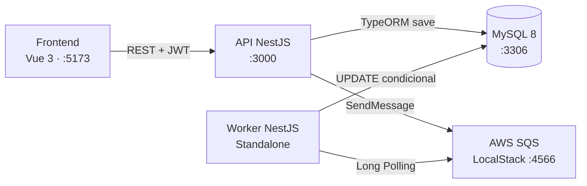

# Be.Aliant Challenge — Sistema de Pedidos

*Monolito Modular + Event-Driven Worker + SPA Vue 3*


---

## Como Rodar

```bash
cp .env.example .env
docker-compose up --build -d

# Opcional: popular banco com dados de demonstração
docker-compose exec api node dist/api/src/database/seed.js
```

| Serviço    | Endereço                  |
|------------|---------------------------|
| API REST   | http://localhost:3000     |
| Frontend   | http://localhost:5173     |
| Adminer    | http://localhost:8080     |
| LocalStack | http://localhost:4566     |

---

## Credenciais de Demonstração

Após executar o seed:

- **Email:** `admin@be-aliant.com`
- **Senha:** `123456`

---

## Testando com Postman

1. Importe o arquivo `be-aliant.postman_collection.json` no Postman
2. Execute **POST /login** — o token JWT é salvo automaticamente na variável `{{token}}`
3. Execute os demais endpoints normalmente

---

## Diagrama de Arquitetura



---

## Estrutura do Monorepo

| Pasta      | Responsabilidade                              |
|------------|-----------------------------------------------|
| `api/`     | NestJS HTTP API — Auth, Users, Orders         |
| `worker/`  | NestJS Standalone — SQS Consumer              |
| `web/`     | Vue 3 SPA — Vite + Pinia + Tailwind           |
| `common/`  | Entidades e DTOs compartilhados               |

---

## Justificativas de Decisões Técnicas

**NestJS vs Express puro**
DI nativo, ValidationPipe, decorators e modularidade clara eliminam boilerplate e tornam a base extensível sem perda de estrutura.

**Worker Standalone**
`NestFactory.createApplicationContext()` inicializa o DI sem servidor HTTP — sem overhead desnecessário para um processo que só consome fila.

**Idempotência via UPDATE condicional**
`UPDATE orders SET status='PROCESSADO' WHERE id=? AND status='PENDENTE'` — se `affected === 0`, a mensagem já foi processada por outra réplica e é descartada sem efeito colateral. Protege contra race condition sem precisar de locks distribuídos.

**`@Global()` no MessagingModule**
Evita reimportar `SqsProducerService` em cada módulo que precise publicar mensagens. Funciona como um singleton de infraestrutura.

---

## O que faria diferente em Produção

**Consistência transacional**
Implementação do Outbox Pattern: o evento SQS seria persistido na mesma transação do `save()`, eliminando a janela de falha entre salvar o pedido e publicar na fila.

**Infraestrutura AWS**
ECS Fargate para API e Worker escaláveis independentemente, Aurora MySQL Multi-AZ, ECR para imagens Docker e ALB na frente da API.

**Segurança**
Cognito ou Auth0 no lugar do JWT caseiro, AWS Secrets Manager para credenciais, HTTPS com ACM, rate limiting via API Gateway.

**Resiliência**
DLQ configurada no SQS (`maxReceiveCount: 3`), healthcheck endpoint com status de dependências (DB, SQS), retry com backoff exponencial no Worker.

**Qualidade**
Swagger/OpenAPI gerado pelo NestJS (`@nestjs/swagger`), SonarQube na pipeline CI, testes E2E com Cypress no frontend, migração para ESLint 9 flat config.

---

## Autor

**Daniel de Queiroz Reis**

[LinkedIn](https://www.linkedin.com/in/danielqreis/) · [GitHub](https://github.com/Daniel-Q-Reis/be-aliant-fullstack-challenge) · [danielqreis@gmail.com](mailto:danielqreis@gmail.com) · [WhatsApp](https://wa.me/5535991902471)
